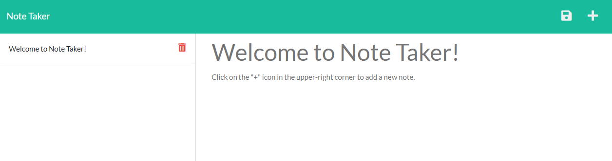

# Express.js Note Taker

Link: [Express Note Taker]()

## Description

This application uses Express.js to save and retrieve data stored in a JSON file. You can view previously stored notes by clicking on the note title in the sidebar. You can also delete a note by clicking on the red trash icon beside it.

## Installation

Be sure to run `npm i` to install `express`.

## Usage

n/a

## Credits

[Zachary Berkley](https://github.com/ZBerkley88)

## License

n/a